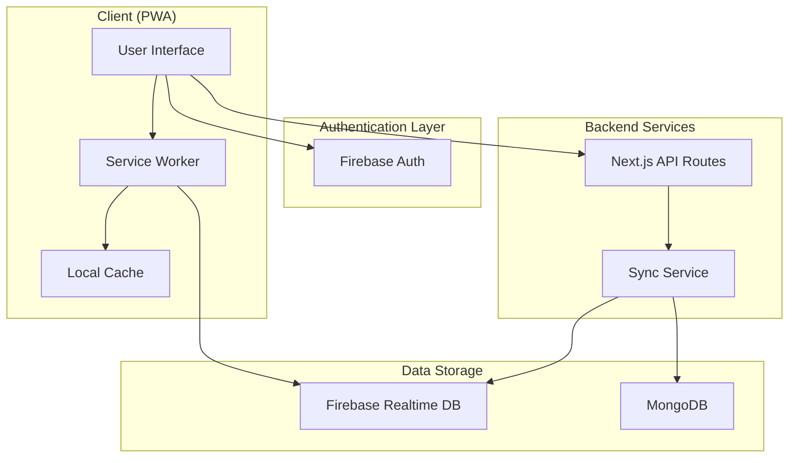
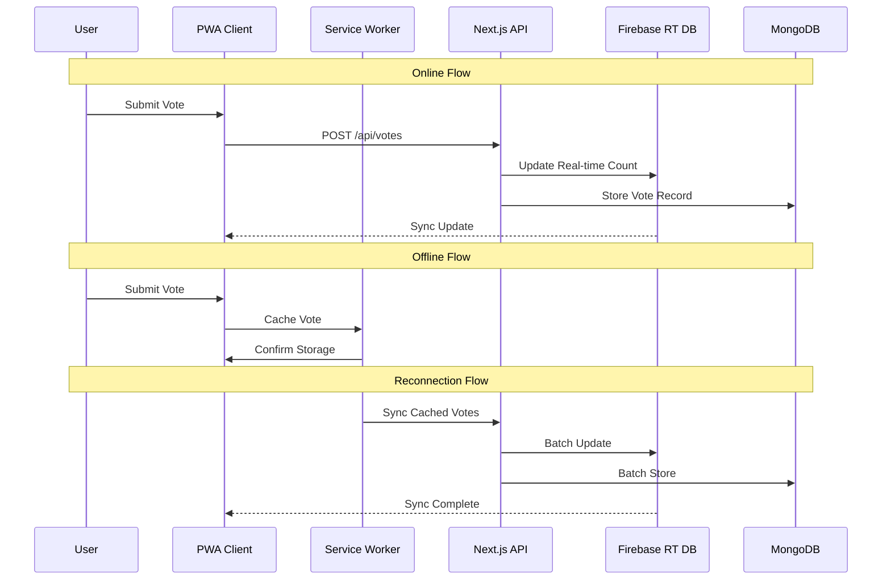
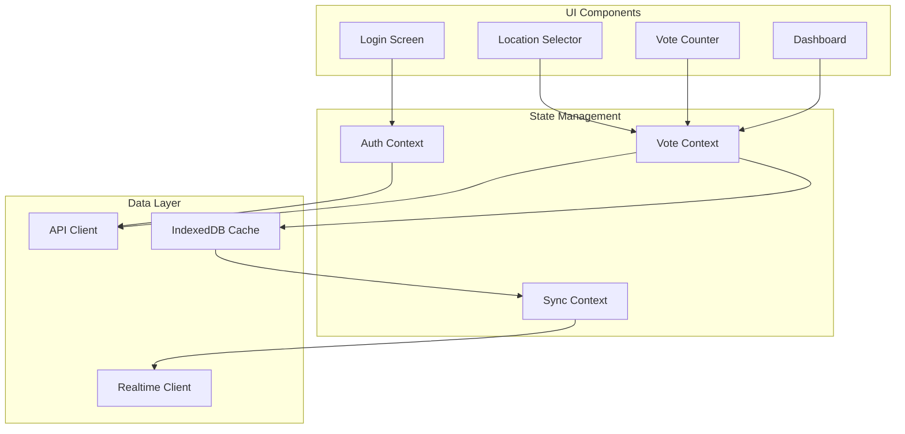
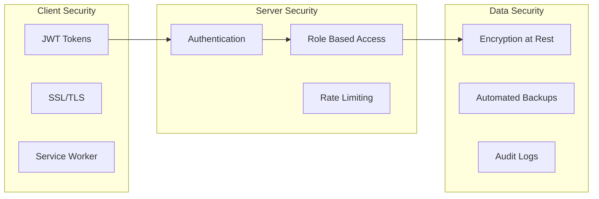
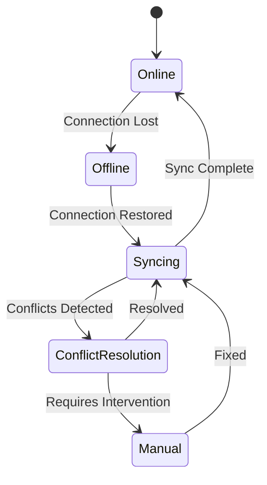

# Vote Counter System Architecture

## System Overview



## Data Flow



## Component Architecture



## Security Architecture



## Offline Sync Strategy



## Deployment Architecture

```mermaid
graph TB
    subgraph Client ["Client Deployment"]
        Vercel[Vercel Edge Network]
        CDN[CDN Cache]
    end

    subgraph Services ["Backend Services"]
        Firebase[Firebase Services]
        NextAPI[Next.js API]
    end

    subgraph Database ["Database Layer"]
        Mongo[MongoDB Atlas]
        RealtimeDB[Firebase Realtime DB]
    end

    Vercel --> Firebase
    Vercel --> NextAPI
    NextAPI --> Mongo
    Firebase --> RealtimeDB